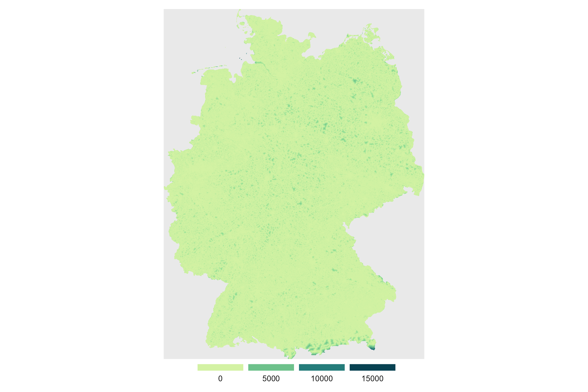

---
output:
    distill::distill_article:
        highlight: kate      ## styling of code
        code_folding: false  ## if 'true' you can expand and shrink code chunks
        toc: true            ## if 'true' adds a table of content
        toc_depth: 2         ## level to be displayed in the table of content
        keep_md: TRUE
---


<div class="layout-chunk" data-layout="l-body">


</div>


<div class="layout-chunk" data-layout="l-body">


</div>


<div class="layout-chunk" data-layout="l-body">


</div>


<div class="layout-chunk" data-layout="l-body">


</div>


<div class="layout-chunk" data-layout="l-screen">
<!-- -->

</div>


<details><summary>Session Info</summary>

<div class="layout-chunk" data-layout="l-body">

```
[1] "2022-09-06 12:33:52 CEST"
```

```
R version 4.2.1 (2022-06-23 ucrt)
Platform: x86_64-w64-mingw32/x64 (64-bit)
Running under: Windows 10 x64 (build 17763)

Matrix products: default

locale:
[1] LC_COLLATE=German_Germany.1252  LC_CTYPE=German_Germany.1252   
[3] LC_MONETARY=German_Germany.1252 LC_NUMERIC=C                   
[5] LC_TIME=C                      

attached base packages:
[1] stats     graphics  grDevices utils     datasets  methods  
[7] base     

other attached packages:
[1] patchwork_1.1.2

loaded via a namespace (and not attached):
 [1] sass_0.4.2           tidyr_1.2.0          jsonlite_1.8.0      
 [4] d6geodata_0.0.0.9000 bslib_0.4.0          assertthat_0.2.1    
 [7] highr_0.9            sp_1.5-0             yaml_2.3.5          
[10] gdtools_0.2.4        pillar_1.8.1         lattice_0.20-45     
[13] glue_1.6.2           uuid_1.1-0           digest_0.6.29       
[16] colorspace_2.0-3     htmltools_0.5.3      pkgconfig_2.0.3     
[19] raster_3.5-21        magick_2.7.3         stars_0.5-6         
[22] s2_1.1.0             bookdown_0.27        purrr_0.3.4         
[25] webshot_0.5.3        scales_1.2.1         processx_3.7.0      
[28] terra_1.6-3          officer_0.4.3        distill_1.4         
[31] downlit_0.4.2        tibble_3.1.8         rcartocolor_2.0.0   
[34] proxy_0.4-27         generics_0.1.3       farver_2.1.1        
[37] ggplot2_3.3.6        ellipsis_0.3.2       cachem_1.0.6        
[40] withr_2.5.0          cli_3.3.0            magrittr_2.0.3      
[43] mime_0.12            ps_1.7.1             memoise_2.0.1       
[46] evaluate_0.16        fansi_1.0.3          xml2_1.3.3          
[49] lwgeom_0.2-8         class_7.3-20         textshaping_0.3.6   
[52] tools_4.2.1          data.table_1.14.2    lifecycle_1.0.1     
[55] stringr_1.4.0        flextable_0.7.3      munsell_0.5.0       
[58] zip_2.2.0            callr_3.7.2          compiler_4.2.1      
[61] jquerylib_0.1.4      e1071_1.7-11         systemfonts_1.0.4   
[64] rlang_1.0.4          classInt_0.4-7       units_0.8-0         
[67] grid_4.2.1           rstudioapi_0.13      labeling_0.4.2      
[70] base64enc_0.1-3      rmarkdown_2.16       wk_0.6.0            
[73] gtable_0.3.1         codetools_0.2-18     abind_1.4-5         
[76] DBI_1.1.3            R6_2.5.1             knitr_1.40          
[79] dplyr_1.0.9          fastmap_1.1.0        utf8_1.2.2          
[82] rprojroot_2.0.3      ragg_1.2.2           KernSmooth_2.23-20  
[85] stringi_1.7.8        parallel_4.2.1       Rcpp_1.0.9          
[88] vctrs_0.4.1          sf_1.0-8             tidyselect_1.1.2    
[91] xfun_0.31           
```

</div>


</details>
```{.r .distill-force-highlighting-css}
```
