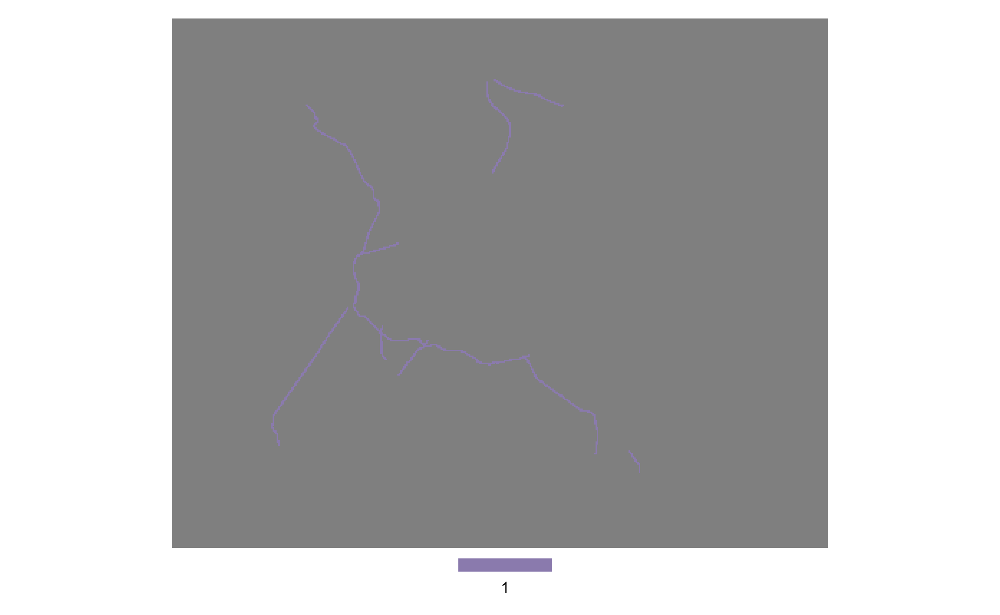

---
output:
    distill::distill_article:
        highlight: kate      ## styling of code
        code_folding: false  ## if 'true' you can expand and shrink code chunks
        toc: true            ## if 'true' adds a table of content
        toc_depth: 2         ## level to be displayed in the table of content
        keep_md: TRUE
---


<div class="layout-chunk" data-layout="l-body">


</div>


# plot

<div class="layout-chunk" data-layout="l-body">


</div>


<div class="layout-chunk" data-layout="l-body">


</div>


<div class="layout-chunk" data-layout="l-body">


</div>





<div class="layout-chunk" data-layout="l-body">


</div>


<div class="layout-chunk" data-layout="l-screen">
<!-- -->

</div>


<details><summary>Session Info</summary>

<div class="layout-chunk" data-layout="l-body">

```
[1] "2022-10-27 14:55:07 CEST"
```

```
R version 4.2.1 (2022-06-23 ucrt)
Platform: x86_64-w64-mingw32/x64 (64-bit)
Running under: Windows 10 x64 (build 17763)

Matrix products: default

locale:
[1] LC_COLLATE=German_Germany.1252  LC_CTYPE=German_Germany.1252   
[3] LC_MONETARY=German_Germany.1252 LC_NUMERIC=C                   
[5] LC_TIME=C                      

attached base packages:
[1] stats     graphics  grDevices utils     datasets  methods  
[7] base     

other attached packages:
[1] patchwork_1.1.2

loaded via a namespace (and not attached):
 [1] Rcpp_1.0.9        here_1.0.1        tidyr_1.2.0      
 [4] ps_1.7.1          png_0.1-7         assertthat_0.2.1 
 [7] rprojroot_2.0.3   digest_0.6.29     utf8_1.2.2       
[10] R6_2.5.1          evaluate_0.16     highr_0.9        
[13] ggplot2_3.3.6     pillar_1.8.1      gdtools_0.2.4    
[16] rlang_1.0.4       uuid_1.1-0        rstudioapi_0.13  
[19] data.table_1.14.2 callr_3.7.2       jquerylib_0.1.4  
[22] magick_2.7.3      flextable_0.7.3   rmarkdown_2.16   
[25] textshaping_0.3.6 webshot_0.5.3     stringr_1.4.0    
[28] munsell_0.5.0     compiler_4.2.1    xfun_0.31        
[31] pkgconfig_2.0.3   systemfonts_1.0.4 base64enc_0.1-3  
[34] htmltools_0.5.3   downlit_0.4.2     tidyselect_1.1.2 
[37] tibble_3.1.8      codetools_0.2-18  fansi_1.0.3      
[40] dplyr_1.0.9       withr_2.5.0       grid_4.2.1       
[43] jsonlite_1.8.0    gtable_0.3.1      lifecycle_1.0.1  
[46] DBI_1.1.3         magrittr_2.0.3    scales_1.2.1     
[49] zip_2.2.0         cli_3.3.0         stringi_1.7.8    
[52] cachem_1.0.6      xml2_1.3.3        bslib_0.4.0      
[55] ellipsis_0.3.2    ragg_1.2.2        generics_0.1.3   
[58] vctrs_0.4.1       distill_1.4       tools_4.2.1      
[61] glue_1.6.2        officer_0.4.3     purrr_0.3.4      
[64] processx_3.7.0    fastmap_1.1.0     yaml_2.3.5       
[67] colorspace_2.0-3  terra_1.6-3       memoise_2.0.1    
[70] knitr_1.40        sass_0.4.2       
```

</div>


</details>
```{.r .distill-force-highlighting-css}
```
